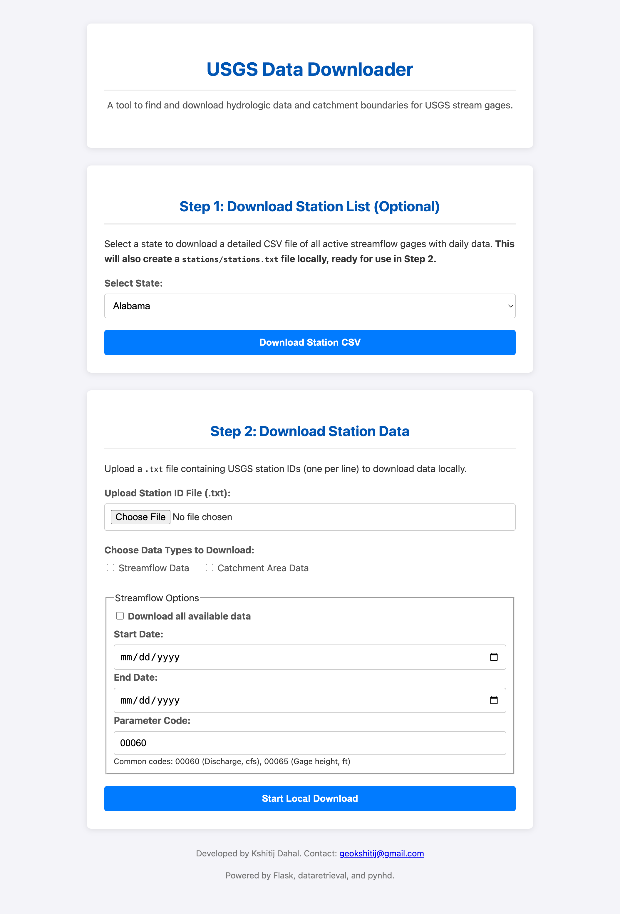

# USGS Data Downloader

A Flask-based web application for downloading hydrologic data and catchment boundaries for USGS stream gages. This tool allows users to easily fetch streamflow data and catchment area information from USGS databases.



## Features

- **Station List Download**: Download a complete list of active USGS stream gages for any US state
- **Streamflow Data**: Download daily discharge and other hydrologic parameters for selected stations
- **Catchment Boundaries**: Download catchment area shapefiles with automatic area calculations
- **Real-time Progress**: Watch your downloads progress with live updates
- **User-Friendly Interface**: Clean, modern web interface for easy navigation

## Prerequisites

- Python 3.8 or higher
- pip (Python package installer)

## Installation

### macOS / Linux

1. Clone or download this repository
2. Open Terminal and navigate to the project directory:
   ```bash
   cd path/to/flowData
   ```
3. Make the installation script executable and run it:
   ```bash
   chmod +x install_mac.sh
   ./install_mac.sh
   ```

### Windows

1. Clone or download this repository
2. Open Command Prompt and navigate to the project directory:
   ```cmd
   cd path\to\flowData
   ```
3. Run the installation script:
   ```cmd
   install_windows.bat
   ```

### Manual Installation

If you prefer to install manually:

1. Create a virtual environment:
   ```bash
   python3 -m venv venv
   ```

2. Activate the virtual environment:
   - **macOS/Linux**: `source venv/bin/activate`
   - **Windows**: `venv\Scripts\activate.bat`

3. Install dependencies:
   ```bash
   pip install -r requirements.txt
   ```

## Usage

### Running the Application

1. Activate the virtual environment (if not already activated):
   - **macOS/Linux**: `source venv/bin/activate`
   - **Windows**: `venv\Scripts\activate.bat`

2. Start the Flask application:
   ```bash
   python app.py
   ```
   or
   ```bash
   python3 app.py
   ```

3. Open your web browser and navigate to:
   ```
   http://127.0.0.1:5001
   ```

### Step 1: Download Station List (Optional)

1. Select a US state from the dropdown menu
2. Click "Download Station CSV" to get a list of all active stream gages
3. This will also create a `stations/stations.txt` file for use in Step 2

### Step 2: Download Station Data

1. Upload a `.txt` file containing USGS station IDs (one per line)
   - You can use the `stations.txt` file created in Step 1
   - Or create your own file with specific station IDs (e.g., `stations_sample.txt`)

2. Select data types to download:
   - **Streamflow Data**: Daily discharge and other parameters
   - **Catchment Area Data**: Watershed boundary shapefiles

3. Configure streamflow options (if selected):
   - Check "Download all available data" for complete historical records
   - Or specify a date range (Start Date and End Date)
   - Enter Parameter Code (default: 00060 for Discharge in cfs)
     - Common codes:
       - `00060`: Discharge (cubic feet per second)
       - `00065`: Gage height (feet)

4. Click "Start Local Download" to begin

5. Monitor progress on the progress page

## Output Files

The application creates the following directories:

- **stations/**: Contains station list files
  - `stations.txt`: List of station IDs from Step 1

- **streamflows/**: Contains streamflow data files
  - Format: `{station_id}.csv`
  - Contains time series data for selected parameters

- **catchments/**: Contains catchment boundary shapefiles
  - Format: `USGS_{station_id}.shp` (plus associated .shx, .dbf, .prj files)
  - Includes calculated drainage area in square kilometers

## Dependencies

- **Flask**: Web framework for the application interface
- **pandas**: Data manipulation and analysis
- **geopandas**: Geospatial data processing
- **dataretrieval**: USGS data retrieval library
- **pynhd**: National Hydrography Dataset tools

See `requirements.txt` for specific versions.

## Troubleshooting

### Import Errors
If you see import errors, ensure the virtual environment is activated and all dependencies are installed:
```bash
pip install -r requirements.txt
```

### Connection Issues
If downloads fail, check your internet connection and ensure USGS services are accessible.

### Port Already in Use
If port 5001 is in use, you can change it in `app.py`:
```python
app.run(debug=True, port=5002)  # Change to any available port
```

## Data Sources

- **USGS NWIS (National Water Information System)**: Streamflow and water quality data
- **NLDI (National Linked Data Index)**: Catchment boundary data

## Author

Developed by Kshitij Dahal

Contact: [geokshitij@gmail.com](mailto:geokshitij@gmail.com)

## License

This project is provided as-is for research and educational purposes.

## Acknowledgments

Powered by:
- Flask
- dataretrieval
- pynhd
- USGS National Water Information System
